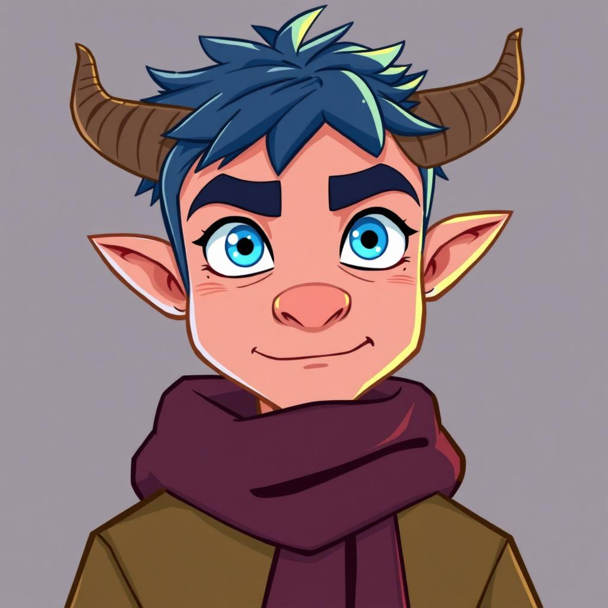

# BedrockELA Design Standard (LOCKED)

## 🔒 Core Design Principles - DO NOT CHANGE

This document defines the standard BedrockELA lesson design. All lessons MUST maintain this structure.

### Visual Structure

**Background:**
- Light turquoise/mint green gradient background
- Calming, easy on eyes for long reading sessions

**Top Navigation Bar:**
- Dark teal background (#305853)
- Left: Orange "🏠 Home" button
- Center: Progress bar (white outline, shows "X% Complete")
- Right: "Lesson X" label + green "● Online" indicator

**Main Content Card:**
- Clean WHITE card with rounded corners
- Drop shadow for depth
- Centered on page
- Max width for readability
- All content INSIDE this white card

**Bottom Navigation Bar:**
- Dark teal background (#305853)
- Left: "← Previous" button (gray when disabled)
- Center: Page dots (yellow = current page)
- Right: Orange "Next →" button

**Bottom Right Corner:**
- Billy widget (circular avatar in green circle)
- Floats above content, doesn't disrupt layout

### Typography

- **Headings:** Nunito (bold, large)
- **Body:** Nunito Sans (regular, readable size)
- **Grade level:** Orange (#B06821)
- **Lesson number:** Dark teal (#305853)

### Billy Instructor Integration (1st Grade)

**Billy appears WITHIN the white content card:**

```html
<div class="lesson-page-card content-page">
    <!-- Billy appears here as a compact bar -->
    <div class="billy-mini-instructor">
        
        <div class="billy-mini-speech">
            <p>Billy's instruction text</p>
        </div>
        <button class="billy-speak-btn">🔊</button>
    </div>
    
    <!-- Rest of page content follows -->
    <h2>Page Title</h2>
    <!-- ... -->
</div>
```

**Billy styling:**
- Green gradient bar (#4a7c3f → #6aaa5c)
- 60px circular avatar (left side)
- White text speech bubble (center)
- Yellow 🔊 button (right side)
- Rounded corners, padding, box shadow
- Appears at TOP of content, not replacing the card structure

### What NOT to Do

❌ Do NOT replace the white card with Billy's UI  
❌ Do NOT remove the top/bottom navigation bars  
❌ Do NOT change the background color  
❌ Do NOT make Billy full-screen  
❌ Do NOT remove the Home button or progress bar  
❌ Do NOT change the page dot navigation  

### Files That Define This Standard

1. **css/lesson-viewer.css** - Core design system
2. **1st-grade-week-1-day-1-HYBRID.html** - Reference implementation
3. **This file (DESIGN-STANDARD.md)** - Design documentation

## Testing Checklist

Before deploying ANY lesson changes, verify:

- [ ] White content card is present
- [ ] Top nav bar (Home + Progress + Online) exists
- [ ] Bottom nav bar (← Previous / dots / Next →) exists
- [ ] Billy (if present) is INSIDE the white card, not replacing it
- [ ] Background is light turquoise
- [ ] Typography uses Nunito/Nunito Sans
- [ ] Page navigation arrows work
- [ ] Progress bar updates correctly

## Version Lock

**Last verified:** 2026-03-07  
**Commit:** bc5bc8bc  
**Status:** ✅ LOCKED - Requires explicit approval to modify base structure
